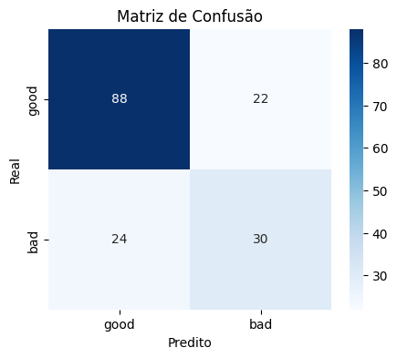

# Exercício 1

## Enunciado

A partir da base de dados:

- Parte 1: Descreva a base de dados descrendo os atributos, numéricos e categóricos, classificando segundo a escala (nominal ou razão) e a cardinalidade (discreta, contínua, binária).

- Parte 2: Descreva cada um dos atributos segundo frequência, mínimo e máximo valor, dia desvios padrão, conforme o caso.

- Parte 3: Avalie os resultados dos processos abaixo, caso sejam utilizados na base de dados, após o processo de classificação com DT ter sido utilizado.
    - limpeza de dados (outlier, missing)
    - normalização/transformação
    - discretização

## Parte 1

Para entender melhor sobre os dados e conseguir classificá-los e descrevê-los, irei fazer uma análise dos mesmos junto a sua descrição fornecida em `dataset_description.txt`.

#### Descrição

https://www.kaggle.com/uciml/german-credit

Context

The original dataset contains 1000 entries with 20 categorial/symbolic attributes prepared by Prof. Hofmann. In this dataset, each entry represents a person who takes a credit by a bank. Each person is classified as good or bad credit risks according to the set of attributes. The link to the original dataset can be found below.

Content

It is almost impossible to understand the original dataset due to its complicated system of categories and symbols. Thus, I wrote a small Python script to convert it into a readable CSV file. Several columns are simply ignored, because in my opinion either they are not important or their descriptions are obscure. The selected attributes are:

- Age (numeric)
- Sex (text: male, female)
- Job (numeric: 0 - unskilled and non-resident, 1 - unskilled and resident, 2 - skilled, 3 - highly skilled)
- Housing (text: own, rent, or free)
- Saving accounts (text - little, moderate, quite rich, rich)
- Checking account (numeric, in DM - Deutsch Mark)
- Credit amount (numeric, in DM)
- Duration (numeric, in month)
- Purpose (text: car, furniture/equipment, radio/TV, domestic appliances, repairs, education, business, vacation/others)


#### Panorama dos dados


```python
df = pd.read_csv('class_german_credit.csv')
df.info()
```

    <class 'pandas.core.frame.DataFrame'>
    RangeIndex: 1000 entries, 0 to 999
    Data columns (total 10 columns):
     #   Column            Non-Null Count  Dtype 
    ---  ------            --------------  ----- 
     0   Age               1000 non-null   int64 
     1   Sex               1000 non-null   object
     2   Job               1000 non-null   int64 
     3   Housing           1000 non-null   object
     4   Saving accounts   817 non-null    object
     5   Checking account  606 non-null    object
     6   Credit amount     1000 non-null   int64 
     7   Duration          1000 non-null   int64 
     8   Purpose           1000 non-null   object
     9   Risk              1000 non-null   object
    dtypes: int64(4), object(6)
    memory usage: 78.3+ KB


Como uma breve interpretação desse resumo dos dados, já podemos ver que há valores faltantes (*missing*) para os atributos `Saving accounts` e `Checking account`.

Além disso, na descrição dada por `dataset_description.txt`, o atributo `Checking account` é dito como numérico, mas acima é dito como `object`, não um tipo numérico como era de se esperar.

Para obter mais informações relevantes acerca dos dado, irei realizar uma análise exploratória sobre cada atributo individualmente.

### Age

Pela descrição em `dataset_description.txt` e no resumo do dataframe, podemos ver que é um dado numérico/quantitativo. Agora irei explorar para obter mais informações desse atributo.


```python
print('--------- descrição estatística ---------')
print(df['Age'].describe())

print('\n--------- valores faltantes ---------')
print(df[df['Age'].isnull()])
```

    --------- descrição estatística ---------
    count    1000.000000
    mean       35.546000
    std        11.375469
    min        19.000000
    25%        27.000000
    50%        33.000000
    75%        42.000000
    max        75.000000
    Name: Age, dtype: float64
    
    --------- valores faltantes ---------
    Empty DataFrame
    Columns: [Age, Sex, Job, Housing, Saving accounts, Checking account, Credit amount, Duration, Purpose, Risk]
    Index: []


Como pode ser observado acima, o atributo `Age` se classifica como **quantitativo discreto** e seu nível (escala) de mensuração é **racional**.

Além disso, claramente não há valores faltantes (*missing*) por terem $1000$ valores dentre $1000$ registros e nenhum deles ser nulo.

Podemos perceber também que não há valores discrepantes (*outliers*) por seus valores mínimo e máximo serem, respectivamente, $19$ e $75$.

### Sex

Pela descrição em `dataset_description.txt` e no resumo do dataframe, podemos ver que é um dado do tipo texto e que assume apenas dois valores `male` (*masculino*) e `female` (*feminino*).


```python
df['Sex'].value_counts(dropna=False).sort_index()
```


    Sex
    female    310
    male      690
    Name: count, dtype: int64


Como observado acima, o atributo, de fato, assume os dois valores (ou categorias) mencionados anteriormente, com isso se classifica como **quantitativa nominal**.

Além disso, somando as frequências temos $1000$ valores aparecendo nesse atributo sendo que nenhum deles é nulo, então não há valores faltantes (*missing*).

### Job

Pela descrição em `dataset_description.txt` e no resumo do dataframe, podemos ver que é um dado do tipo categórico, apesar de ser representado de forma numérica.


```python
df['Job'].value_counts(dropna=False).sort_index()
```


    Job
    0     22
    1    200
    2    630
    3    148
    Name: count, dtype: int64


Não é possível identificar muito bem as frequências sem consultar o mapeamento em `dataset_description.txt`. Para facilitar a leitura irei fazer o mapeamento direto na contagem de valores.

Mas antes disso, já é possível dizer que se trata de um dado **qualitativo ordinal** e que não há valores faltantes.


```python
job_titles = {
    0: 'Unskilled and non-resident',
    1: 'Unskilled and resident',
    2: 'Skilled',
    3: 'Highly skilled'
}
job_counts = df['Job'].value_counts().sort_index()
job_counts.index = job_counts.index.map(job_titles)
job_counts
```


    Job
    Unskilled and non-resident     22
    Unskilled and resident        200
    Skilled                       630
    Highly skilled                148
    Name: count, dtype: int64


> Dúvida para investigar: para árvore de decisão, esse campo deverá/poderá permanecer numérico ou deverá ser textual?

> R.: Por essa variável ser ordinal e seus valores estarem adequados com as categorias, i.e., 0 representa o menos qualidicado e 3, o mais qualificado (segue a ordem do menor para o maior), o modelo conseguirá interpretá-la da maneira correta. O problema seria se fosse nominal. O modelo poderia entender que existe uma ordem e certa distância entre as categorias por serem números.

### Housing

Pela descrição em `dataset_description.txt` e no resumo do dataframe, podemos ver que é um dado do tipo categórico.


```python
df['Housing'].value_counts(dropna=False).sort_index()
```


    Housing
    free    108
    own     713
    rent    179
    Name: count, dtype: int64


Pode-se ver que é um atributo do tipo **qualitativo nominal** e que não há valores faltantes, pois a soma das frequências acima é $1000$.

### Saving account

Pela descrição em `dataset_description.txt` e no resumo do dataframe, podemos ver que é um dado do tipo texto.


```python
df['Saving accounts'].value_counts(dropna=False).sort_index()
```


    Saving accounts
    little        603
    moderate      103
    quite rich     63
    rich           48
    NaN           183
    Name: count, dtype: int64


Temos um atributo do tipo **qualitativo ordinal** e que apresenta valores faltantes, 183 registros não apresentam valor para este atributo.

### Checking Account

Como mencionado anteriormente, esse campo é dito como numérico em `dataset_description.txt`, mas no resumo do dataframe é dito como `object`. Irei investigar seus possíveis valores para entender melhor como esse atributo se classifica de fato.


```python
df['Checking account'].value_counts(dropna=False).sort_index()
```


    Checking account
    little      274
    moderate    269
    rich         63
    NaN         394
    Name: count, dtype: int64


Observando seus valores, podemos ver que é classificado como **qualitativo ordinal** e que há 394 valores faltantes.

### Credit Amount

Pela descrição em `dataset_description.txt` e no resumo do dataframe, podemos ver que é um dado do tipo numérico.


```python
print('\n--------- descrição estatística ---------')
print(df['Credit amount'].describe())
print('\n--------- valores faltantes ---------')
print(df[df['Credit amount'].isnull()])
```

    
    --------- descrição estatística ---------
    count     1000.000000
    mean      3271.258000
    std       2822.736876
    min        250.000000
    25%       1365.500000
    50%       2319.500000
    75%       3972.250000
    max      18424.000000
    Name: Credit amount, dtype: float64
    
    --------- valores faltantes ---------
    Empty DataFrame
    Columns: [Age, Sex, Job, Housing, Saving accounts, Checking account, Credit amount, Duration, Purpose, Risk]
    Index: []


E pelo resumo acima pode-se ver que esse atributo é **quantitativo racional** e não tem valores faltantes.

### Duration

Pela descrição em `dataset_description.txt` e no resumo do dataframe, podemos ver que é um dado do tipo numérico.


```python
print('\n--------- descrição estatística ---------')
print(df['Duration'].describe())
print('\n--------- valores faltantes ---------')
print(df[df['Duration'].isnull()])
```

    
    --------- descrição estatística ---------
    count    1000.000000
    mean       20.903000
    std        12.058814
    min         4.000000
    25%        12.000000
    50%        18.000000
    75%        24.000000
    max        72.000000
    Name: Duration, dtype: float64
    
    --------- valores faltantes ---------
    Empty DataFrame
    Columns: [Age, Sex, Job, Housing, Saving accounts, Checking account, Credit amount, Duration, Purpose, Risk]
    Index: []


E pelo resumo acima pode-se ver que esse atributo é **quantitativo racional** e não tem valores faltantes.

### Purpose

Pela descrição em `dataset_description.txt` e no resumo do dataframe, podemos ver que é um dado do tipo textual.


```python
df['Purpose'].value_counts(dropna=False).sort_index()
```


    Purpose
    business                97
    car                    337
    domestic appliances     12
    education               59
    furniture/equipment    181
    radio/TV               280
    repairs                 22
    vacation/others         12
    Name: count, dtype: int64


Pode-se ver que se classifica como **qualitativo nominal** e não há valores faltantes.

### Risk

Por último, iremos avaliar a coluna que contém a informação que queremos que nosso modelo aprenda a inferir. Que diz se uma pessoa é boa (good) ou ruim (bad) com relação ao risco de crédito.


```python
df['Risk'].value_counts(dropna=False).sort_index()
```


    Risk
    bad     300
    good    700
    Name: count, dtype: int64


Percebemos que é **qualitativa ordinal**, uma variável binária, que não tem valores faltantes, mas que está desbalanceada. Isso é um detalhe a ser considerado na hora de treinar o modelo.

### Resumo

Segue abaixo um resumo dos atributos.


```python
resumo_df = pd.DataFrame({
    'atributo': ['Age', 'Sex', 'Job', 'Housing', 'Saving accounts',
                 'Checking account', 'Credit amount', 'Duration', 'Purpose', 'Risk'],
    'tipo': ['quantitativo racional', 'qualitativa nominal', 'qualitativa ordinal',
             'qualitativa nominal', 'qualitativa ordinal', 'qualitativa ordinal',
             'quantitativo racional', 'quantitativo racional', 'qualitativa nominal', 'qualitativa nominal'],
    'valores faltantes': [0, 0, 0, 0, 183, 394, 0, 0, 0, 0],
    'outliers': ['não', 'n/a', 'n/a', 'n/a', 'n/a', 'n/a', 'não', 'não', 'n/a', 'n/a'],
    'cardinalidade': ['discreta', 'discreta (binária)', 'discreta', 'discreta',
                      'discreta', 'discreta', 'contínua', 'discreta', 'discreta', 'discreta (binária)']
})
resumo_df
```


<div>
<style scoped>
    .dataframe tbody tr th:only-of-type {
        vertical-align: middle;
    }

    .dataframe tbody tr th {
        vertical-align: top;
    }

    .dataframe thead th {
        text-align: right;
    }
</style>
<table border="1" class="dataframe">
  <thead>
    <tr style="text-align: right;">
      <th></th>
      <th>atributo</th>
      <th>tipo</th>
      <th>valores faltantes</th>
      <th>outliers</th>
      <th>cardinalidade</th>
    </tr>
  </thead>
  <tbody>
    <tr>
      <th>0</th>
      <td>Age</td>
      <td>quantitativo racional</td>
      <td>0</td>
      <td>não</td>
      <td>discreta</td>
    </tr>
    <tr>
      <th>1</th>
      <td>Sex</td>
      <td>qualitativa nominal</td>
      <td>0</td>
      <td>n/a</td>
      <td>discreta (binária)</td>
    </tr>
    <tr>
      <th>2</th>
      <td>Job</td>
      <td>qualitativa ordinal</td>
      <td>0</td>
      <td>n/a</td>
      <td>discreta</td>
    </tr>
    <tr>
      <th>3</th>
      <td>Housing</td>
      <td>qualitativa nominal</td>
      <td>0</td>
      <td>n/a</td>
      <td>discreta</td>
    </tr>
    <tr>
      <th>4</th>
      <td>Saving accounts</td>
      <td>qualitativa ordinal</td>
      <td>183</td>
      <td>n/a</td>
      <td>discreta</td>
    </tr>
    <tr>
      <th>5</th>
      <td>Checking account</td>
      <td>qualitativa ordinal</td>
      <td>394</td>
      <td>n/a</td>
      <td>discreta</td>
    </tr>
    <tr>
      <th>6</th>
      <td>Credit amount</td>
      <td>quantitativo racional</td>
      <td>0</td>
      <td>não</td>
      <td>contínua</td>
    </tr>
    <tr>
      <th>7</th>
      <td>Duration</td>
      <td>quantitativo racional</td>
      <td>0</td>
      <td>não</td>
      <td>discreta</td>
    </tr>
    <tr>
      <th>8</th>
      <td>Purpose</td>
      <td>qualitativa nominal</td>
      <td>0</td>
      <td>n/a</td>
      <td>discreta</td>
    </tr>
    <tr>
      <th>9</th>
      <td>Risk</td>
      <td>qualitativa nominal</td>
      <td>0</td>
      <td>n/a</td>
      <td>discreta (binária)</td>
    </tr>
  </tbody>
</table>
</div>


## Avaliação da Árvore de Decisão

## Definindo as funções a serem utilizadas

### Treinar uma árvore de decisão


```python
def trained_model(X_train, y_train, scorer, show_best_params=False, show_tree=False):
    param_grid = {
        'max_depth': [2, 4, 8, 16, 32, 64, None],
        'min_samples_split': [2, 4, 8, 16, 32, 64],
        'min_samples_leaf': [1, 2, 4, 8, 16, 32, 64]
    }

    grid_search = GridSearchCV(
        DecisionTreeClassifier(random_state=42),
        param_grid,
        cv=5,  # 5-fold cross-validation
        scoring=scorer,
        n_jobs=-1
    )

    grid_search.fit(X_train, y_train)
    
    model = grid_search.best_estimator_

    if show_best_params:
        print('Melhores hiperparâmetros:', grid_search.best_params_)
    
    if show_tree:
        tree.plot_tree(
            model,
            feature_names=X_train.columns,
            class_names=['good', 'bad'],
            filled = True
        )
        plt.show()

    return model

def predict_and_evaluate(model, X_test, y_test):
    # Avaliação no conjunto de teste
    y_pred = model.predict(X_test)

    recall = recall_score(y_test, y_pred, pos_label='bad')
    accuracy = accuracy_score(y_test, y_pred)
    
    print('Relatório:')
    print(f'recall (bad): {recall:.2f}')
    print(f'accuracy: {accuracy:.2f}')

    cm = confusion_matrix(y_test, y_pred, labels=['good', 'bad'])
    plt.figure(figsize=(5,4))
    plt.title('Matriz de Confusão')
    sns.heatmap(cm, annot=True, fmt='d', cmap='Blues', xticklabels=['good', 'bad'], yticklabels=['good', 'bad'])
    plt.xlabel('Predito')
    plt.ylabel('Real')
    plt.show()

```

### Preparação mínima

A árvore de decisão exige uma preparação mínima dos atributos qualitativos. Os mesmo não podem ser textuais, devem ter uma representação numérica ou passível de conversão em tipo numérico. Farei essa preparação nos atributos (qualitativos) listados abaixo.


```python
resumo_df[resumo_df['tipo'].str.contains('qualitativa')]
```


<div>
<style scoped>
    .dataframe tbody tr th:only-of-type {
        vertical-align: middle;
    }

    .dataframe tbody tr th {
        vertical-align: top;
    }

    .dataframe thead th {
        text-align: right;
    }
</style>
<table border="1" class="dataframe">
  <thead>
    <tr style="text-align: right;">
      <th></th>
      <th>atributo</th>
      <th>tipo</th>
      <th>valores faltantes</th>
      <th>outliers</th>
      <th>cardinalidade</th>
    </tr>
  </thead>
  <tbody>
    <tr>
      <th>1</th>
      <td>Sex</td>
      <td>qualitativa nominal</td>
      <td>0</td>
      <td>n/a</td>
      <td>discreta (binária)</td>
    </tr>
    <tr>
      <th>2</th>
      <td>Job</td>
      <td>qualitativa ordinal</td>
      <td>0</td>
      <td>n/a</td>
      <td>discreta</td>
    </tr>
    <tr>
      <th>3</th>
      <td>Housing</td>
      <td>qualitativa nominal</td>
      <td>0</td>
      <td>n/a</td>
      <td>discreta</td>
    </tr>
    <tr>
      <th>4</th>
      <td>Saving accounts</td>
      <td>qualitativa ordinal</td>
      <td>183</td>
      <td>n/a</td>
      <td>discreta</td>
    </tr>
    <tr>
      <th>5</th>
      <td>Checking account</td>
      <td>qualitativa ordinal</td>
      <td>394</td>
      <td>n/a</td>
      <td>discreta</td>
    </tr>
    <tr>
      <th>8</th>
      <td>Purpose</td>
      <td>qualitativa nominal</td>
      <td>0</td>
      <td>n/a</td>
      <td>discreta</td>
    </tr>
    <tr>
      <th>9</th>
      <td>Risk</td>
      <td>qualitativa nominal</td>
      <td>0</td>
      <td>n/a</td>
      <td>discreta (binária)</td>
    </tr>
  </tbody>
</table>
</div>


### Funções de preparação dos dados


```python
def prepare_sex(df):
    df_preparado = df.copy()
    df_preparado.loc[df_preparado['Sex'] == 'male', 'Sex'] = False
    df_preparado.loc[df_preparado['Sex'] == 'female', 'Sex'] = True
    df_preparado['Sex'] = df_preparado['Sex'].astype(bool)
    return df_preparado

# Job -> Ja esta representado com numeros da forma correta

def prepare_housing(df):
    df_preparado = df.copy()
    dummies = pd.get_dummies(df_preparado['Housing'])
    df_preparado = pd.concat([df_preparado, dummies], axis=1)
    df_preparado = df_preparado.drop('Housing', axis=1)
    return df_preparado

def prepare_saving_accounts(df):
    # 0 = little, 1 = moderate, 2 = quite rich, 3 = rich
    df_preparado = df.copy()
    df_preparado.loc[df_preparado['Saving accounts'] == 'little', 'Saving accounts'] = 0
    df_preparado.loc[df_preparado['Saving accounts'] == 'moderate', 'Saving accounts'] = 1
    df_preparado.loc[df_preparado['Saving accounts'] == 'quite rich', 'Saving accounts'] = 2
    df_preparado.loc[df_preparado['Saving accounts'] == 'rich', 'Saving accounts'] = 3
    return df_preparado

def prepare_checking_account(df):
    # 0 = little, 1 = moderate, 2 = rich
    df_preparado = df.copy()
    df_preparado.loc[df_preparado['Checking account'] == 'little', 'Checking account'] = 0
    df_preparado.loc[df_preparado['Checking account'] == 'moderate', 'Checking account'] = 1
    df_preparado.loc[df_preparado['Checking account'] == 'rich', 'Checking account'] = 2
    return df_preparado

def prepare_purpose(df):
    df_preparado = df.copy()
    dummies = pd.get_dummies(df_preparado['Purpose'])
    df_preparado = pd.concat([df_preparado, dummies], axis=1)
    df_preparado = df_preparado.drop('Purpose', axis=1)
    return df_preparado

def prepare_all(df_preparado):
    df_preparado = prepare_sex(df_preparado)
    df_preparado = prepare_housing(df_preparado)
    df_preparado = prepare_saving_accounts(df_preparado)
    df_preparado = prepare_checking_account(df_preparado)
    df_preparado = prepare_purpose(df_preparado)
    return df_preparado

df_preparado = prepare_all(df.copy())
df_preparado.head()
```


<div>
<style scoped>
    .dataframe tbody tr th:only-of-type {
        vertical-align: middle;
    }

    .dataframe tbody tr th {
        vertical-align: top;
    }

    .dataframe thead th {
        text-align: right;
    }
</style>
<table border="1" class="dataframe">
  <thead>
    <tr style="text-align: right;">
      <th></th>
      <th>Age</th>
      <th>Sex</th>
      <th>Job</th>
      <th>Saving accounts</th>
      <th>Checking account</th>
      <th>Credit amount</th>
      <th>Duration</th>
      <th>Risk</th>
      <th>free</th>
      <th>own</th>
      <th>rent</th>
      <th>business</th>
      <th>car</th>
      <th>domestic appliances</th>
      <th>education</th>
      <th>furniture/equipment</th>
      <th>radio/TV</th>
      <th>repairs</th>
      <th>vacation/others</th>
    </tr>
  </thead>
  <tbody>
    <tr>
      <th>0</th>
      <td>67</td>
      <td>False</td>
      <td>2</td>
      <td>NaN</td>
      <td>0</td>
      <td>1169</td>
      <td>6</td>
      <td>good</td>
      <td>False</td>
      <td>True</td>
      <td>False</td>
      <td>False</td>
      <td>False</td>
      <td>False</td>
      <td>False</td>
      <td>False</td>
      <td>True</td>
      <td>False</td>
      <td>False</td>
    </tr>
    <tr>
      <th>1</th>
      <td>22</td>
      <td>True</td>
      <td>2</td>
      <td>0</td>
      <td>1</td>
      <td>5951</td>
      <td>48</td>
      <td>bad</td>
      <td>False</td>
      <td>True</td>
      <td>False</td>
      <td>False</td>
      <td>False</td>
      <td>False</td>
      <td>False</td>
      <td>False</td>
      <td>True</td>
      <td>False</td>
      <td>False</td>
    </tr>
    <tr>
      <th>2</th>
      <td>49</td>
      <td>False</td>
      <td>1</td>
      <td>0</td>
      <td>NaN</td>
      <td>2096</td>
      <td>12</td>
      <td>good</td>
      <td>False</td>
      <td>True</td>
      <td>False</td>
      <td>False</td>
      <td>False</td>
      <td>False</td>
      <td>True</td>
      <td>False</td>
      <td>False</td>
      <td>False</td>
      <td>False</td>
    </tr>
    <tr>
      <th>3</th>
      <td>45</td>
      <td>False</td>
      <td>2</td>
      <td>0</td>
      <td>0</td>
      <td>7882</td>
      <td>42</td>
      <td>good</td>
      <td>True</td>
      <td>False</td>
      <td>False</td>
      <td>False</td>
      <td>False</td>
      <td>False</td>
      <td>False</td>
      <td>True</td>
      <td>False</td>
      <td>False</td>
      <td>False</td>
    </tr>
    <tr>
      <th>4</th>
      <td>53</td>
      <td>False</td>
      <td>2</td>
      <td>0</td>
      <td>0</td>
      <td>4870</td>
      <td>24</td>
      <td>bad</td>
      <td>True</td>
      <td>False</td>
      <td>False</td>
      <td>False</td>
      <td>True</td>
      <td>False</td>
      <td>False</td>
      <td>False</td>
      <td>False</td>
      <td>False</td>
      <td>False</td>
    </tr>
  </tbody>
</table>
</div>


### Avaliação

Quero que o modelo acerte mais na classificação de pessoas que são más (`bad`) devedoras. Isso para garantir que o modelo não diga que uma pessoa é boa devedora, i.e., pagará seu empréstimo, quando a pessoa não é e não pagará. Dessa forma, diminui as chances de sair no prejuízo.
Claro que não posso deixar de observar também a classificação dos bons (`good`) devedores, pois se o modelo os classifica errado, é dinheiro que deixa de entrar.

### Sem Tratamento dos Dados


```python
def execute_experiment(df, show_best_params=False, show_tree=False):
    X = df.drop('Risk', axis=1)
    y = df['Risk']

    X_train, X_test, y_train, y_test = train_test_split(
        X, y, test_size=0.2, random_state=42, stratify=y
    )

    scorer = make_scorer(recall_score, pos_label='bad')

    model = trained_model(
        X_train,
        y_train,
        scorer,
        show_best_params=show_best_params,
        show_tree=show_tree
    )
    predict_and_evaluate(model, X_test, y_test)

df_preparado = prepare_all(df.copy())
execute_experiment(df_preparado, show_tree=True)
```


    

    


    Relatório:
    recall (bad): 0.50
    accuracy: 0.65


    

    


Sem tratamento de dados, temos um `recall` de $0.5$ e `accuracy` de $0.65$. Não foi um resultado promissor, mas sinto que pode melhorar.

### Limpando os Dados

Como não há *outliers* nessa base, não preciso me preocupar com o tratamento desse tipo de problema. Mas há $183$ valores faltantes para `Saving accounts` e $394$ para `Checking account`.

#### Removendo Linhas

Pela base de dados ter poucos registros ($1000$), acredito que seguir pela estratégia de remoção de linhas irá mais atrapalhar o modelo do que ajudar, mas não custa fazer a avaliação. Para isso, irei avaliar dois pontos que me preocupam:

1. Quantos registros terei da base se remover registros com valores faltantes?
2. A proporcionalidade entre as classes de `Risk` se manterá?

Farei a avaliação desses dois pontos para os seguintes cenários:
1. Removendo o atributo `Saving accounts`
2. Removendo o atributo `Checking account`
3. Removendo ambos.


```python
total = len(df)
risk_good = len(df[df['Risk'] == 'good'])
risk_bad = len(df[df['Risk'] == 'bad'])

df_sem_saving = df.dropna(subset=['Saving accounts'])
risk_good_sem_saving = len(df_sem_saving[df_sem_saving['Risk'] == 'good'])
risk_bad_sem_saving = len(df_sem_saving[df_sem_saving['Risk'] == 'bad'])

df_sem_checking = df.dropna(subset=['Checking account'])
risk_good_sem_checking = len(df_sem_checking[df_sem_checking['Risk'] == 'good'])
risk_bad_sem_cheking = len(df_sem_checking[df_sem_checking['Risk'] == 'bad'])

df_sem_ambos = df.dropna(subset=['Saving accounts', 'Checking account'])
risk_good_sem_ambos = len(df_sem_ambos[df_sem_ambos['Risk'] == 'good'])
risk_bad_sem_ambos = len(df_sem_ambos[df_sem_ambos['Risk'] == 'bad'])

rotulos = ('Base Original', 'Cenário 1', 'Cenário 2', 'Cenário 3')
risks = {
    'good': [risk_good, risk_good_sem_saving, risk_good_sem_checking, risk_good_sem_ambos],
    'bad': [risk_bad, risk_bad_sem_saving, risk_bad_sem_cheking, risk_bad_sem_ambos]
}

fig, ax = plt.subplots()
ax.set_ylim(0, 1200)

bottom = np.zeros(4)

for risk, values in risks.items():
    p = ax.bar(rotulos, values, label=risk, bottom=bottom)
    bottom += values
    ax.bar_label(p, label_type='center')

for idx, total in enumerate(bottom):
    ax.text(idx, total + 60, f'{int(total)} registros', ha='center', va='bottom')
    good_percentage = (risks['good'][idx] / total) * 100
    bad_percentage = (risks['bad'][idx] / total) * 100
    ax.text(idx, total + 10, f'{good_percentage:.2f}% : {bad_percentage:.2f}%', ha='center', va='bottom',)

ax.set_title('Exclusão de linhas com valores faltantes')
ax.legend()

plt.show()
```


    

    


Como podemos perceber, para cada estratégia, ficamos com cada vez menos registros e a razão entre os valores do atributo `Risk` também altera consideravelmente. A única estratégia que talvez ajude será a do cenário 1, removendo os registros nulos para o atributo `Saving accounts`. Escrevo isso com bastante desconfiança, pois ainda acredito não ser uma boa estratégia, mas irei avaliá-la para ter certeza.

#### Cenário 1 - Sem `Saving accounts`


```python
df_preparado = prepare_all(df.copy())
df_cleaned = df_preparado.dropna(subset=['Saving accounts'])
execute_experiment(df_cleaned, show_tree=True)
```


    

    


    Relatório:
    recall (bad): 0.56
    accuracy: 0.72


    

    


Até que remover a coluna `Saving accounts`, ao contrário do que eu esperava, melhorou o modelo. Tanto pelo `recall` quanto pela acurácia (`accuracy`). Contudo, não irei avaliar para os demais cenários mencionados acima pelos fatores mencionados: diminuem consideravelmente a quantidade de dados e alteram a proporção das classes: `good` e `bad`.

#### Missing - Moda

A estratégia que irei experimentar agora será de atribuir o valor da moda aos valores faltantes. Considerando, é claro, a proporção entre as diferentes classes: `good` e `bad`.


```python
def fill_with_mode(df, column):
    goods_filter = df['Risk'] == 'good'
    bads_filter = df['Risk'] == 'bad'

    goods = df[goods_filter]
    bads = df[bads_filter]

    good_mode = goods[column].mode()[0]
    bad_mode = bads[column].mode()[0]

    df.loc[goods_filter, column] = df.loc[goods_filter, column].fillna(good_mode)
    df.loc[bads_filter, column] = df.loc[bads_filter, column].fillna(bad_mode)
    
    return df

df_mode_filled = prepare_all(df.copy())
df_mode_filled = fill_with_mode(df_mode_filled, 'Saving accounts')
df_mode_filled = fill_with_mode(df_mode_filled, 'Checking account')

execute_experiment(df_mode_filled, show_tree=True)
```

    /tmp/ipykernel_1519998/2571373263.py:11: FutureWarning: Downcasting object dtype arrays on .fillna, .ffill, .bfill is deprecated and will change in a future version. Call result.infer_objects(copy=False) instead. To opt-in to the future behavior, set `pd.set_option('future.no_silent_downcasting', True)`
      df.loc[goods_filter, column] = df.loc[goods_filter, column].fillna(good_mode)
    /tmp/ipykernel_1519998/2571373263.py:12: FutureWarning: Downcasting object dtype arrays on .fillna, .ffill, .bfill is deprecated and will change in a future version. Call result.infer_objects(copy=False) instead. To opt-in to the future behavior, set `pd.set_option('future.no_silent_downcasting', True)`
      df.loc[bads_filter, column] = df.loc[bads_filter, column].fillna(bad_mode)
    /tmp/ipykernel_1519998/2571373263.py:11: FutureWarning: Downcasting object dtype arrays on .fillna, .ffill, .bfill is deprecated and will change in a future version. Call result.infer_objects(copy=False) instead. To opt-in to the future behavior, set `pd.set_option('future.no_silent_downcasting', True)`
      df.loc[goods_filter, column] = df.loc[goods_filter, column].fillna(good_mode)
    /tmp/ipykernel_1519998/2571373263.py:12: FutureWarning: Downcasting object dtype arrays on .fillna, .ffill, .bfill is deprecated and will change in a future version. Call result.infer_objects(copy=False) instead. To opt-in to the future behavior, set `pd.set_option('future.no_silent_downcasting', True)`
      df.loc[bads_filter, column] = df.loc[bads_filter, column].fillna(bad_mode)


    

    


    Relatório:
    recall (bad): 0.63
    accuracy: 0.79


    

    


Com esse tratamento, o modelo melhorou consideravelmente, tendo aumentado o `recall` para $0.63$ e a acurácia para $0.79$. Além disso, é perceptível, também, como a profuncidade e densidade da árvore mudaram e com isso ela ficou mais simples. Tornando o uso do modelo mais rápido, além de melhor (pelo menos em comparação com os casos anteriores).

Me dou por satisfeito com esse resultado após a limpeza dos dados.

# Exercício 2

Faça uma análise de seleção de variáveis utilizando os métodos que julgar necessários, considerando o tipo de dado. Abaixo uma tabela é indicada para que possa usar como inspiração avaliação de importância composta dos métodos que considerar. 

## Método 1 - Árvore de Decisão


```python
df_preparado = prepare_all(df.copy())

X = df_preparado.drop('Risk', axis=1)
y = df_preparado['Risk']

X_train, X_test, y_train, y_test = train_test_split(
    X, y, test_size=0.2, random_state=42, stratify=y
)

model = DecisionTreeClassifier(random_state=42)
model.fit(X_train, y_train)
tree_importances = pd.Series(model.feature_importances_, index=X.columns)
tree_importances.sort_values(ascending=False)

```


    Credit amount          0.195448
    Age                    0.189478
    Duration               0.155385
    Checking account       0.150071
    Saving accounts        0.060795
    Job                    0.042556
    car                    0.032372
    furniture/equipment    0.029035
    Sex                    0.026972
    radio/TV               0.025156
    own                    0.018321
    education              0.018052
    business               0.013373
    rent                   0.012579
    repairs                0.010924
    free                   0.009959
    domestic appliances    0.005291
    vacation/others        0.004233
    dtype: float64


## Método 2 - ANOVA


```python
df_preparado = prepare_all(df.copy())

df_preparado.dropna(inplace=True)

X = df_preparado.drop('Risk', axis=1)
y = df_preparado['Risk']

X_train, X_test, y_train, y_test = train_test_split(
    X, y, test_size=0.2, random_state=42, stratify=y
)

anova_selector = SelectKBest(score_func=f_classif, k='all')
anova_selector.fit(X_train, y_train)
anova_scores = pd.Series(anova_selector.scores_, index=X.columns)
anova_scores.sort_values(ascending=False)
```


    Duration               38.794960
    Credit amount          10.636884
    Saving accounts         9.207652
    Checking account        8.922135
    own                     6.505199
    rent                    5.108268
    Sex                     4.150256
    education               2.691121
    repairs                 1.826396
    radio/TV                1.297288
    Age                     1.235157
    car                     1.122064
    free                    0.795872
    vacation/others         0.717230
    Job                     0.666234
    domestic appliances     0.077968
    furniture/equipment     0.041039
    business                0.016375
    dtype: float64


## Qui-quadrado ($\chi^2$)


```python
df_preparado = prepare_all(df.copy())

df_preparado.dropna(inplace=True)

X = df_preparado.drop('Risk', axis=1)
y = df_preparado['Risk']

X_train, X_test, y_train, y_test = train_test_split(
    X, y, test_size=0.2, random_state=42, stratify=y
)

chi2_selector = SelectKBest(score_func=chi2, k='all')
chi2_selector.fit(X_train, y_train)
chi2_scores = pd.Series(chi2_selector.scores_, index=X.columns)
chi2_scores.sort_values(ascending=False)

```


    Credit amount          27156.692405
    Duration                 262.452894
    Saving accounts           15.568178
    Checking account           6.117038
    Age                        5.123471
    rent                       4.109880
    Sex                        2.782348
    education                  2.538483
    own                        2.052624
    repairs                    1.787721
    radio/TV                   0.990968
    car                        0.736138
    vacation/others            0.707366
    free                       0.694816
    Job                        0.165251
    domestic appliances        0.077202
    furniture/equipment        0.033026
    business                   0.014638
    dtype: float64


```python
ranking_df = pd.DataFrame({
    'Decision Tree': tree_importances,
    'ANOVA': anova_scores,
    'Chi2': chi2_scores
})

ranking_df_ranked = ranking_df.rank(ascending=False)
ranking_df_ranked = ranking_df_ranked.sort_values(by=['Decision Tree', 'ANOVA', 'Chi2'], ascending=True)
```

Após a execução dos seletores acima, temos as seguintes importâncias dos atributos com base em cada seletor.


```python
ranking_df_ranked
```


<div>
<style scoped>
    .dataframe tbody tr th:only-of-type {
        vertical-align: middle;
    }

    .dataframe tbody tr th {
        vertical-align: top;
    }

    .dataframe thead th {
        text-align: right;
    }
</style>
<table border="1" class="dataframe">
  <thead>
    <tr style="text-align: right;">
      <th></th>
      <th>Decision Tree</th>
      <th>ANOVA</th>
      <th>Chi2</th>
    </tr>
  </thead>
  <tbody>
    <tr>
      <th>Credit amount</th>
      <td>1.0</td>
      <td>2.0</td>
      <td>1.0</td>
    </tr>
    <tr>
      <th>Age</th>
      <td>2.0</td>
      <td>11.0</td>
      <td>5.0</td>
    </tr>
    <tr>
      <th>Duration</th>
      <td>3.0</td>
      <td>1.0</td>
      <td>2.0</td>
    </tr>
    <tr>
      <th>Checking account</th>
      <td>4.0</td>
      <td>4.0</td>
      <td>4.0</td>
    </tr>
    <tr>
      <th>Saving accounts</th>
      <td>5.0</td>
      <td>3.0</td>
      <td>3.0</td>
    </tr>
    <tr>
      <th>Job</th>
      <td>6.0</td>
      <td>15.0</td>
      <td>15.0</td>
    </tr>
    <tr>
      <th>car</th>
      <td>7.0</td>
      <td>12.0</td>
      <td>12.0</td>
    </tr>
    <tr>
      <th>furniture/equipment</th>
      <td>8.0</td>
      <td>17.0</td>
      <td>17.0</td>
    </tr>
    <tr>
      <th>Sex</th>
      <td>9.0</td>
      <td>7.0</td>
      <td>7.0</td>
    </tr>
    <tr>
      <th>radio/TV</th>
      <td>10.0</td>
      <td>10.0</td>
      <td>11.0</td>
    </tr>
    <tr>
      <th>own</th>
      <td>11.0</td>
      <td>5.0</td>
      <td>9.0</td>
    </tr>
    <tr>
      <th>education</th>
      <td>12.0</td>
      <td>8.0</td>
      <td>8.0</td>
    </tr>
    <tr>
      <th>business</th>
      <td>13.0</td>
      <td>18.0</td>
      <td>18.0</td>
    </tr>
    <tr>
      <th>rent</th>
      <td>14.0</td>
      <td>6.0</td>
      <td>6.0</td>
    </tr>
    <tr>
      <th>repairs</th>
      <td>15.0</td>
      <td>9.0</td>
      <td>10.0</td>
    </tr>
    <tr>
      <th>free</th>
      <td>16.0</td>
      <td>13.0</td>
      <td>14.0</td>
    </tr>
    <tr>
      <th>domestic appliances</th>
      <td>17.0</td>
      <td>16.0</td>
      <td>16.0</td>
    </tr>
    <tr>
      <th>vacation/others</th>
      <td>18.0</td>
      <td>14.0</td>
      <td>13.0</td>
    </tr>
  </tbody>
</table>
</div>


Avaliando a tabela acima, podemos ver a importância de cada atributo e selecionar apenas as ($n$) primeiras $^1$ para treinamento e execução de algum modelo de *machine learning*. Isso para que consideremos apenas os atributos que são, de fato, úteis para o aprendizado e não causem ruídos.

$_{ \text{1. } n \text{ deve ser avaliado para cada cenário }}$
